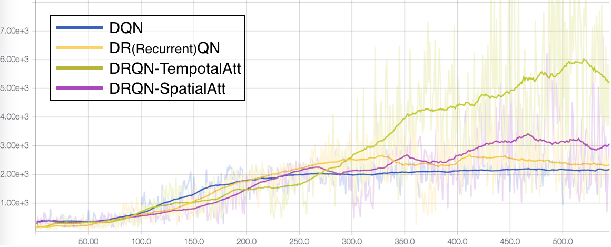

# Deep Recurrent Attention Reinforcement Learning in Atari

This is my course project for [CMU-10703](https://katefvision.github.io).
The code is implemented in Tensorflow and Keras. Full detail can be found in this [paper]().

This Tensorflow(Keras) implementation of Deep Reinforcement Learning contains:

[1] [Playing Atari with Deep Reinforcement Learning](http://arxiv.org/abs/1312.5602)
[2] [Deep Reinforcement Learning with Double Q-learning](http://arxiv.org/abs/1509.06461)
[3] [Dueling Network Architectures for Deep Reinforcement Learning](http://arxiv.org/abs/1511.06581)
[4] [Deep Recurrent Q-Learning for Partially Observable MDPs](https://arxiv.org/abs/1507.06527)
[5] [DQN with Spatial Attention](https://arxiv.org/abs/1512.01693)
[6] [DQN with Temporal Attention](http://cs229.stanford.edu/proj2016/report/ChenYingLaird-DeepQLearningWithRecurrentNeuralNetwords-report.pdf)

## Requirements

The code is based on **Python 3**. Run:

	pip install --user -r requirements.txt
    
## How to run

There are two types of DQN implementation with gpu: keras and pure tensorflow.
You can choose different implementation by altering **line 15** in 
**dqn_atari.py**

Train original DQN:

	python dqn_atari.py --task_name 'DQN'
    
Train Double DQN:

	python dqn_atari.py --ddqn --task_name 'Double_DQN'
    
Train Dueling DQN:

	python dqn_atari.py --net_mode=duel --task_name 'Dueling_DQN'

Train Recurrent DQN:

	python dqn_atari.py --num_frames 10 --recurrent --task_name 'Recurrent_DQN'
    
Train Recurrent Temporal Attention DQN: (Using **dqn_tf_temporalAt.py** by uncommenting**line 18** in **dqn_atari.py**)

	python dqn_atari.py --num_frames 10 --recurrent --a_t --selector --task_name 'TemporalAt_DQN'

Train Recurrent Spatial Attention DQN: (Using **dqn_tf_spatialAt.py** by uncommenting**line 21** in **dqn_atari.py**)

	python dqn_atari.py --num_frames 10 --recurrent --a_t --selector --task_name 'SpatialAt_DQN'

Test trained model (e.g. Spatial Attention DQN):

	python dqn_atari.py --num_frames 10 --recurrent --a_t --selector --test \
    --load_network --load_network_path=PATH_TO_NET

## Results

Results of `Seaquest-v0` for DQN (Blue), DRQN (yellow), DRQN-TemporalAttention (brown), DRQN-SpatialAttention (purple):

Analysis of Recurrent Temporal Attention DQN: 
The number at the corner is the weight of this frame.

Analysis of Recurrent Spatial Attention DQN:
The attention focuses on the enemy before the action.

## Acknowledgement

This project is a joint work with Rui Zhu, Bo Chen and Hanyue Liang.
    

